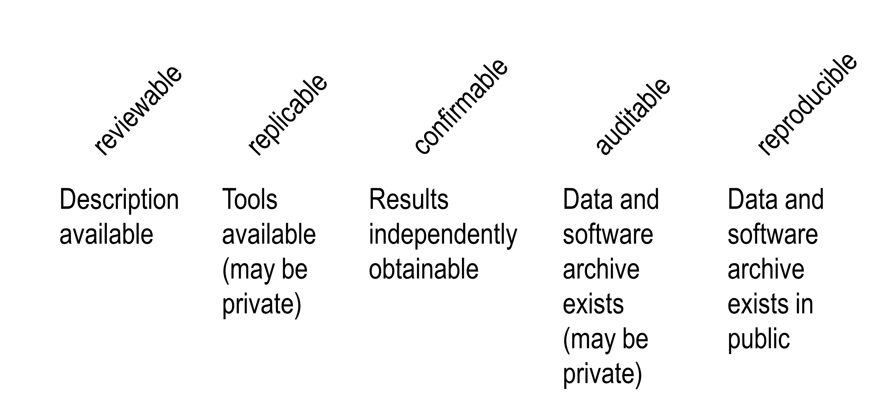
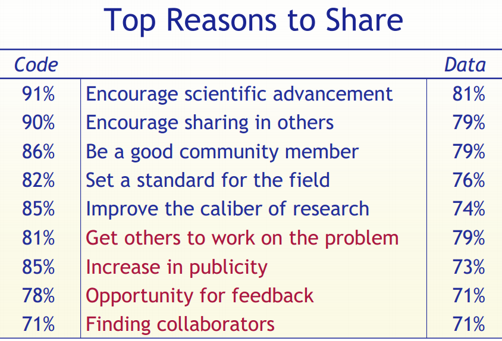

Reproducible Research: A view from the social sciences
========================================================
author: Ben Marwick, UW Anthropology
date: April 2014
transition: none
---
ext_widgets : {rCharts: libraries/nvd3}
---

Overview
========================================================
- Definitions, motives, history, spectrum
- Current practices 
- A selection of tools to improve reproducibility 
- Challenges, standards & our role in the future of reproducible research

Definitions
========================================================


<small><small>Stodden, V., et al. 2013. "Setting the default to reproducible." computational science research. SIAM News 46: 4-6.</small></small>

<small><small>"The goal of reproducible research is to tie specific instructions to data analysis and experimental data so that scholarship can be recreated, better understood and verified."  - Max Kuhn, CRAN Task View: Reproducible Research </small></small>

History of reproducible research
=======================================================
- Mathematics (400 BC?)
- Write scientific paper, Galileo, Pasteur, etc.  (1660s?)
- Publish a pidgin algorithm and describe simulation datasets (1950s?)
- Sell magtape of code and data (1970s?)
- Place idiosyncratic dataset & software at website (1990s?)
- Publish datasets and scripts at website, eg. biology, political science, genetics, statistics (2000s?)
- Hosted integrated code and data (2020s?)

<small><small>Gavish & Gonoho AAAS 2011, Oxberry 2013</small></small>

Motivations: Claerbout's principle
========================================================

>"An article about computational result is advertising, not scholarship. The actual scholarship is the full software environment, code and data, that produced the result." <small><small>- Claerbout and Karrenbach, Proceedings of the 62nd Annual International Meeting of the Society of Exploration Geophysics. 1992</small></small>

>"When we publish articles containing figures which were generated by computer, we also publish the complete software environment which generates the figures" <small><small>- Buckheit & Donoho, Wavelab and Reproducible Research, 1995.</small></small>

Benefits are straightforward
=======================================================
- **Verification & Reliability**: Easier to find and fix bugs. The results you produce today will be the same results you will produce tomorrow.
- **Transparency**: Leads increased citation count, broader impact, improved institutional memory
- **Efficiency**: Reuse allows for de-duplication of effort. Payoff in the (not so) long run
- **Flexibility**: When you don’t 'point-and-click' you gain many new analytic options.

But the limitations are substantial
=======================================================
Technical
- Classified/sensitive/big data 
- Software licensing issues
- Competition
- Neither necessary nor sufficient for correctness (but essential for dispute resolution)

***

Cultural & personal 
- Very few researchers follow even minimal reproducibility standards.
- No-one expects or requires reproducibility 
- No uniform standards of reproducibility, so no established user base
- Inertia & embarassment

Our work exists on a spectrum of reproducibility
=======================================================

<small><small>Peng 2011, Science 334(6060) pp. 1226-1227</small></small>

Goal is to expose the reader to more of the research workflow
=======================================================

<small><small><small>http://www.stodden.net/AMP2011/slides/pengslides.pdf</small></small></small>

Current practices, or informal ethnographic observations of social science research workers
========================================================
type: alert


Qualitative observations
========================================================
- Enter data in Excel
- Use Excel for data cleaning & descriptive statistics
- Import data into SPSS/SAS/Stata for further analysis
- Use point-and-click options to run statistical analyses
- Copy & paste output to Word document, repeatedly

***


Qualitative observations
========================================================
- Version control is ad hoc
- Excel handles missing data inconsistently and sometimes incorrectly 
- Many common functions are poor or missing in Excel
- Scripting is possible but rare 


***


Click trails are ephemeral & dangerous
========================================================


***

- Lots of human effort for tedious & time-wasting tasks
- Error-prone due to manual & ad hoc data handling (column and row offsets are common)
- Difficult to record -  hard to reconstruct a 'click history'
- Tiny changes in data or method require extensive reworking efforts


Case study: Reinhart and Rogoff controversy
========================================================
`
 
`


***

`
`
- Claimed that higher debt-to-G.D.P. ratios are associated with lower levels of G.D.P. growth
- Identified the threshold to -ve growth at a debt-to-G.D.P. ratio of >90%
- Substantial popular impact on autsterity politics 


Case study: Reinhart and Rogoff controversy
========================================================


Scripted analyses are superior
========================================================


***

- Plain text files will be readable for a long time
- Improved transparency, automation, maintanability, accessibility, standardisation, modularity, portability, efficiency, communicability of process (what more could we want?)
- But there's a steep learning curve  


Literate statistical programming 
========================================================
The alternative to point-and-click analyses

>"Instead of imagining that our main task is to instruct a computer what to do, let us concentrate rather on explaining to humans what we want the computer to do."-- <small><small>Donald E. Knuth, Literate Programming, 1984</small></small>

***

For example...
Let's calculate the current time in R.

```r
time <- format(Sys.time(), "%a %d %b %X %Y")
```

The text and R code are interwoven in the output:

The time is `` `r time` ``

The time is Wed 09 Apr 3:08:04 PM 2014


Literate programming: for and against 
========================================================
For
- Text and code all in one place, in logical order
- Tables and figures automatically updated to reflect data and method changes
- Automatic test when building document

Against
- Text and code all in one place; can be hard to read sometimes, especially if there is a lot of code (externalising can help)
- Can substantially slow down the processing of documents
(caching can help)


A selection of my favourite tools for reproducible research (which also seem to be widely used by others in the social sciences)
========================================================
type: alert


Which programming language?
========================================================
The machine-readable part

R: Free, open source, cross-platform, highly interactive, huge user community in academica and private sector

R packages: an ideal 'Compendium'?


***

>"both a container for the different elements that make up the document and its computations (i.e. text, code, data, etc.), and as a means for distributing, managing and updating the collection... allow us to move from an era of advertisement to one where our scholarship itself is published" <small><small>- Gentleman and Temple Lang 2004</small></small>


Documentation of code simplified with roxygen2
========================================================


Interactive data exploration with the rCharts package
========================================================
<link rel='stylesheet' href=http://nvd3.org/assets/css/nv.d3.css>
<script type='text/javascript' src=http://ajax.googleapis.com/ajax/libs/jquery/1.8.2/jquery.min.js></script>
<script type='text/javascript' src=http://d3js.org/d3.v3.min.js></script>
<script type='text/javascript' src=http://timelyportfolio.github.io/rCharts_nvd3_tests/libraries/widgets/nvd3/js/nv.d3.min-new.js></script>
<script type='text/javascript' src=http://nvd3.org/assets/lib/fisheye.js></script> 
 <style>
  .rChart {
    display: block;
    margin-left: auto; 
    margin-right: auto;
    width: 800px;
    height: 400px;
  }  
  </style>
<div id = 'chartb8458b26e69' class = 'rChart nvd3'></div>
<script type='text/javascript'>
 $(document).ready(function(){
      drawchartb8458b26e69()
    });
    function drawchartb8458b26e69(){  
      var opts = {
 "dom": "chartb8458b26e69",
"width":    800,
"height":    400,
"x": "wt",
"y": "mpg",
"type": "scatterChart",
"id": "chartb8458b26e69" 
},
        data = [
 {
 "mpg":             21,
"cyl":              6,
"disp":            160,
"hp":            110,
"drat":            3.9,
"wt":           2.62,
"qsec":          16.46,
"vs":              0,
"am":              1,
"gear":              4,
"carb":              4 
},
{
 "mpg":             21,
"cyl":              6,
"disp":            160,
"hp":            110,
"drat":            3.9,
"wt":          2.875,
"qsec":          17.02,
"vs":              0,
"am":              1,
"gear":              4,
"carb":              4 
},
{
 "mpg":           22.8,
"cyl":              4,
"disp":            108,
"hp":             93,
"drat":           3.85,
"wt":           2.32,
"qsec":          18.61,
"vs":              1,
"am":              1,
"gear":              4,
"carb":              1 
},
{
 "mpg":           21.4,
"cyl":              6,
"disp":            258,
"hp":            110,
"drat":           3.08,
"wt":          3.215,
"qsec":          19.44,
"vs":              1,
"am":              0,
"gear":              3,
"carb":              1 
},
{
 "mpg":           18.7,
"cyl":              8,
"disp":            360,
"hp":            175,
"drat":           3.15,
"wt":           3.44,
"qsec":          17.02,
"vs":              0,
"am":              0,
"gear":              3,
"carb":              2 
},
{
 "mpg":           18.1,
"cyl":              6,
"disp":            225,
"hp":            105,
"drat":           2.76,
"wt":           3.46,
"qsec":          20.22,
"vs":              1,
"am":              0,
"gear":              3,
"carb":              1 
},
{
 "mpg":           14.3,
"cyl":              8,
"disp":            360,
"hp":            245,
"drat":           3.21,
"wt":           3.57,
"qsec":          15.84,
"vs":              0,
"am":              0,
"gear":              3,
"carb":              4 
},
{
 "mpg":           24.4,
"cyl":              4,
"disp":          146.7,
"hp":             62,
"drat":           3.69,
"wt":           3.19,
"qsec":             20,
"vs":              1,
"am":              0,
"gear":              4,
"carb":              2 
},
{
 "mpg":           22.8,
"cyl":              4,
"disp":          140.8,
"hp":             95,
"drat":           3.92,
"wt":           3.15,
"qsec":           22.9,
"vs":              1,
"am":              0,
"gear":              4,
"carb":              2 
},
{
 "mpg":           19.2,
"cyl":              6,
"disp":          167.6,
"hp":            123,
"drat":           3.92,
"wt":           3.44,
"qsec":           18.3,
"vs":              1,
"am":              0,
"gear":              4,
"carb":              4 
},
{
 "mpg":           17.8,
"cyl":              6,
"disp":          167.6,
"hp":            123,
"drat":           3.92,
"wt":           3.44,
"qsec":           18.9,
"vs":              1,
"am":              0,
"gear":              4,
"carb":              4 
},
{
 "mpg":           16.4,
"cyl":              8,
"disp":          275.8,
"hp":            180,
"drat":           3.07,
"wt":           4.07,
"qsec":           17.4,
"vs":              0,
"am":              0,
"gear":              3,
"carb":              3 
},
{
 "mpg":           17.3,
"cyl":              8,
"disp":          275.8,
"hp":            180,
"drat":           3.07,
"wt":           3.73,
"qsec":           17.6,
"vs":              0,
"am":              0,
"gear":              3,
"carb":              3 
},
{
 "mpg":           15.2,
"cyl":              8,
"disp":          275.8,
"hp":            180,
"drat":           3.07,
"wt":           3.78,
"qsec":             18,
"vs":              0,
"am":              0,
"gear":              3,
"carb":              3 
},
{
 "mpg":           10.4,
"cyl":              8,
"disp":            472,
"hp":            205,
"drat":           2.93,
"wt":           5.25,
"qsec":          17.98,
"vs":              0,
"am":              0,
"gear":              3,
"carb":              4 
},
{
 "mpg":           10.4,
"cyl":              8,
"disp":            460,
"hp":            215,
"drat":              3,
"wt":          5.424,
"qsec":          17.82,
"vs":              0,
"am":              0,
"gear":              3,
"carb":              4 
},
{
 "mpg":           14.7,
"cyl":              8,
"disp":            440,
"hp":            230,
"drat":           3.23,
"wt":          5.345,
"qsec":          17.42,
"vs":              0,
"am":              0,
"gear":              3,
"carb":              4 
},
{
 "mpg":           32.4,
"cyl":              4,
"disp":           78.7,
"hp":             66,
"drat":           4.08,
"wt":            2.2,
"qsec":          19.47,
"vs":              1,
"am":              1,
"gear":              4,
"carb":              1 
},
{
 "mpg":           30.4,
"cyl":              4,
"disp":           75.7,
"hp":             52,
"drat":           4.93,
"wt":          1.615,
"qsec":          18.52,
"vs":              1,
"am":              1,
"gear":              4,
"carb":              2 
},
{
 "mpg":           33.9,
"cyl":              4,
"disp":           71.1,
"hp":             65,
"drat":           4.22,
"wt":          1.835,
"qsec":           19.9,
"vs":              1,
"am":              1,
"gear":              4,
"carb":              1 
},
{
 "mpg":           21.5,
"cyl":              4,
"disp":          120.1,
"hp":             97,
"drat":            3.7,
"wt":          2.465,
"qsec":          20.01,
"vs":              1,
"am":              0,
"gear":              3,
"carb":              1 
},
{
 "mpg":           15.5,
"cyl":              8,
"disp":            318,
"hp":            150,
"drat":           2.76,
"wt":           3.52,
"qsec":          16.87,
"vs":              0,
"am":              0,
"gear":              3,
"carb":              2 
},
{
 "mpg":           15.2,
"cyl":              8,
"disp":            304,
"hp":            150,
"drat":           3.15,
"wt":          3.435,
"qsec":           17.3,
"vs":              0,
"am":              0,
"gear":              3,
"carb":              2 
},
{
 "mpg":           13.3,
"cyl":              8,
"disp":            350,
"hp":            245,
"drat":           3.73,
"wt":           3.84,
"qsec":          15.41,
"vs":              0,
"am":              0,
"gear":              3,
"carb":              4 
},
{
 "mpg":           19.2,
"cyl":              8,
"disp":            400,
"hp":            175,
"drat":           3.08,
"wt":          3.845,
"qsec":          17.05,
"vs":              0,
"am":              0,
"gear":              3,
"carb":              2 
},
{
 "mpg":           27.3,
"cyl":              4,
"disp":             79,
"hp":             66,
"drat":           4.08,
"wt":          1.935,
"qsec":           18.9,
"vs":              1,
"am":              1,
"gear":              4,
"carb":              1 
},
{
 "mpg":             26,
"cyl":              4,
"disp":          120.3,
"hp":             91,
"drat":           4.43,
"wt":           2.14,
"qsec":           16.7,
"vs":              0,
"am":              1,
"gear":              5,
"carb":              2 
},
{
 "mpg":           30.4,
"cyl":              4,
"disp":           95.1,
"hp":            113,
"drat":           3.77,
"wt":          1.513,
"qsec":           16.9,
"vs":              1,
"am":              1,
"gear":              5,
"carb":              2 
},
{
 "mpg":           15.8,
"cyl":              8,
"disp":            351,
"hp":            264,
"drat":           4.22,
"wt":           3.17,
"qsec":           14.5,
"vs":              0,
"am":              1,
"gear":              5,
"carb":              4 
},
{
 "mpg":           19.7,
"cyl":              6,
"disp":            145,
"hp":            175,
"drat":           3.62,
"wt":           2.77,
"qsec":           15.5,
"vs":              0,
"am":              1,
"gear":              5,
"carb":              6 
},
{
 "mpg":             15,
"cyl":              8,
"disp":            301,
"hp":            335,
"drat":           3.54,
"wt":           3.57,
"qsec":           14.6,
"vs":              0,
"am":              1,
"gear":              5,
"carb":              8 
},
{
 "mpg":           21.4,
"cyl":              4,
"disp":            121,
"hp":            109,
"drat":           4.11,
"wt":           2.78,
"qsec":           18.6,
"vs":              1,
"am":              1,
"gear":              4,
"carb":              2 
} 
]
  
      if(!(opts.type==="pieChart" || opts.type==="sparklinePlus")) {
        var data = d3.nest()
          .key(function(d){
            //return opts.group === undefined ? 'main' : d[opts.group]
            //instead of main would think a better default is opts.x
            return opts.group === undefined ? opts.y : d[opts.group];
          })
          .entries(data);
      }
      
      if (opts.disabled != undefined){
        data.map(function(d, i){
          d.disabled = opts.disabled[i]
        })
      }
      
      nv.addGraph(function() {
        var chart = nv.models[opts.type]()
          .x(function(d) { return d[opts.x] })
          .y(function(d) { return d[opts.y] })
          .width(opts.width)
          .height(opts.height)
         
        
          
        

        
        
        
      
       d3.select("#" + opts.id)
        .append('svg')
        .datum(data)
        .transition().duration(500)
        .call(chart);

       nv.utils.windowResize(chart.update);
       return chart;
      });
    };
</script>


Interactive data exploration with the rCharts package
========================================================

<iframe srcdoc='
&lt;!doctype HTML&gt;
&lt;meta charset = &#039;utf-8&#039;&gt;
&lt;html&gt;
  &lt;head&gt;
    &lt;link rel=&#039;stylesheet&#039; href=&#039;http://nvd3.org/assets/css/nv.d3.css&#039;&gt;
    
    &lt;script src=&#039;http://ajax.googleapis.com/ajax/libs/jquery/1.8.2/jquery.min.js&#039; type=&#039;text/javascript&#039;&gt;&lt;/script&gt;
    &lt;script src=&#039;http://d3js.org/d3.v3.min.js&#039; type=&#039;text/javascript&#039;&gt;&lt;/script&gt;
    &lt;script src=&#039;http://timelyportfolio.github.io/rCharts_nvd3_tests/libraries/widgets/nvd3/js/nv.d3.min-new.js&#039; type=&#039;text/javascript&#039;&gt;&lt;/script&gt;
    &lt;script src=&#039;http://nvd3.org/assets/lib/fisheye.js&#039; type=&#039;text/javascript&#039;&gt;&lt;/script&gt;
    
    &lt;style&gt;
    .rChart {
      display: block;
      margin-left: auto; 
      margin-right: auto;
      width: 600px;
      height: 300px;
    }  
    &lt;/style&gt;
    
  &lt;/head&gt;
  &lt;body&gt;
    &lt;div id=&#039;chartb84d9ddbe&#039; class=&#039;rChart nvd3&#039;&gt;&lt;/div&gt;  
    
    &lt;script type=&#039;text/javascript&#039;&gt;
 $(document).ready(function(){
      drawchartb84d9ddbe()
    });
    function drawchartb84d9ddbe(){  
      var opts = {
 &quot;dom&quot;: &quot;chartb84d9ddbe&quot;,
&quot;width&quot;:    600,
&quot;height&quot;:    300,
&quot;x&quot;: &quot;Hair&quot;,
&quot;y&quot;: &quot;Freq&quot;,
&quot;group&quot;: &quot;Eye&quot;,
&quot;type&quot;: &quot;multiBarChart&quot;,
&quot;id&quot;: &quot;chartb84d9ddbe&quot; 
},
        data = [
 {
 &quot;Hair&quot;: &quot;Black&quot;,
&quot;Eye&quot;: &quot;Brown&quot;,
&quot;Sex&quot;: &quot;Male&quot;,
&quot;Freq&quot;:             32 
},
{
 &quot;Hair&quot;: &quot;Brown&quot;,
&quot;Eye&quot;: &quot;Brown&quot;,
&quot;Sex&quot;: &quot;Male&quot;,
&quot;Freq&quot;:             53 
},
{
 &quot;Hair&quot;: &quot;Red&quot;,
&quot;Eye&quot;: &quot;Brown&quot;,
&quot;Sex&quot;: &quot;Male&quot;,
&quot;Freq&quot;:             10 
},
{
 &quot;Hair&quot;: &quot;Blond&quot;,
&quot;Eye&quot;: &quot;Brown&quot;,
&quot;Sex&quot;: &quot;Male&quot;,
&quot;Freq&quot;:              3 
},
{
 &quot;Hair&quot;: &quot;Black&quot;,
&quot;Eye&quot;: &quot;Blue&quot;,
&quot;Sex&quot;: &quot;Male&quot;,
&quot;Freq&quot;:             11 
},
{
 &quot;Hair&quot;: &quot;Brown&quot;,
&quot;Eye&quot;: &quot;Blue&quot;,
&quot;Sex&quot;: &quot;Male&quot;,
&quot;Freq&quot;:             50 
},
{
 &quot;Hair&quot;: &quot;Red&quot;,
&quot;Eye&quot;: &quot;Blue&quot;,
&quot;Sex&quot;: &quot;Male&quot;,
&quot;Freq&quot;:             10 
},
{
 &quot;Hair&quot;: &quot;Blond&quot;,
&quot;Eye&quot;: &quot;Blue&quot;,
&quot;Sex&quot;: &quot;Male&quot;,
&quot;Freq&quot;:             30 
},
{
 &quot;Hair&quot;: &quot;Black&quot;,
&quot;Eye&quot;: &quot;Hazel&quot;,
&quot;Sex&quot;: &quot;Male&quot;,
&quot;Freq&quot;:             10 
},
{
 &quot;Hair&quot;: &quot;Brown&quot;,
&quot;Eye&quot;: &quot;Hazel&quot;,
&quot;Sex&quot;: &quot;Male&quot;,
&quot;Freq&quot;:             25 
},
{
 &quot;Hair&quot;: &quot;Red&quot;,
&quot;Eye&quot;: &quot;Hazel&quot;,
&quot;Sex&quot;: &quot;Male&quot;,
&quot;Freq&quot;:              7 
},
{
 &quot;Hair&quot;: &quot;Blond&quot;,
&quot;Eye&quot;: &quot;Hazel&quot;,
&quot;Sex&quot;: &quot;Male&quot;,
&quot;Freq&quot;:              5 
},
{
 &quot;Hair&quot;: &quot;Black&quot;,
&quot;Eye&quot;: &quot;Green&quot;,
&quot;Sex&quot;: &quot;Male&quot;,
&quot;Freq&quot;:              3 
},
{
 &quot;Hair&quot;: &quot;Brown&quot;,
&quot;Eye&quot;: &quot;Green&quot;,
&quot;Sex&quot;: &quot;Male&quot;,
&quot;Freq&quot;:             15 
},
{
 &quot;Hair&quot;: &quot;Red&quot;,
&quot;Eye&quot;: &quot;Green&quot;,
&quot;Sex&quot;: &quot;Male&quot;,
&quot;Freq&quot;:              7 
},
{
 &quot;Hair&quot;: &quot;Blond&quot;,
&quot;Eye&quot;: &quot;Green&quot;,
&quot;Sex&quot;: &quot;Male&quot;,
&quot;Freq&quot;:              8 
} 
]
  
      if(!(opts.type===&quot;pieChart&quot; || opts.type===&quot;sparklinePlus&quot;)) {
        var data = d3.nest()
          .key(function(d){
            //return opts.group === undefined ? &#039;main&#039; : d[opts.group]
            //instead of main would think a better default is opts.x
            return opts.group === undefined ? opts.y : d[opts.group];
          })
          .entries(data);
      }
      
      if (opts.disabled != undefined){
        data.map(function(d, i){
          d.disabled = opts.disabled[i]
        })
      }
      
      nv.addGraph(function() {
        var chart = nv.models[opts.type]()
          .x(function(d) { return d[opts.x] })
          .y(function(d) { return d[opts.y] })
          .width(opts.width)
          .height(opts.height)
         
        
          
        

        
        
        
      
       d3.select(&quot;#&quot; + opts.id)
        .append(&#039;svg&#039;)
        .datum(data)
        .transition().duration(500)
        .call(chart);

       nv.utils.windowResize(chart.update);
       return chart;
      });
    };
&lt;/script&gt;
    
  &lt;/body&gt;
&lt;/html&gt;
' scrolling='no' seamless class='rChart 
nvd3
 '
id=iframe-
chartb84d9ddbe
></iframe>
<style>iframe.rChart{ width: 100%; height: 400px;}</style>


IPython-style notebooks for R (RCloud, IRKernel)
========================================================


Which document formatting language?
========================================================
`
 
`


Markdown: lightweight document formatting syntax
based on email text formatting. Easy to write, read and publish as-is.

***
The human-readable part

rmarkdown: 
- minor extensions to allow R code display and execution
- embed images in html files (convenient for sharing)
- equations

Dynamic documents in R
========================================================
knitr - descendant of Sweave  

Engine for dynamic report generation in R


***

- Narrative and code in the same file or explicitly linked
- When data or narrative are updated, the document is automatically updated
- Data treated as 'read only'
- Output treated as disposable

Pandoc converts output from rmarkdown in many popular formats
========================================================
`
`

A universal document converter, open source, cross-platform

- Write code and narrative in rmarkdown   
- use knitr to computate figures and tables   
- use pandoc to get HTML/PDF/DOCX

...with a single simple R function `render` 

***
`
`


<small><small><small>http://kieranhealy.org/blog/archives/2014/01/23/plain-text/ </small></small></small>

Tracking changes with version control 
========================================================
Payoffs
- Eases collaboration
- Can track changes in any file type (ideally plain text), and who made them
- Can revert file to any point in its tracked history

Costs
- Unfamiliar to most social scientists 
- Takes time to master

***


An environment for reproducible research
========================================================
RStudio is a free, open source, cross-platform IDE for R

With integrated R console, deep support for markdown and git, a text editor, a workspace browser, a data viewer, package development tools, etc. etc.

RStudio 'projects' make version control & literate programming simple

***


Making data public
========================================================
Payoffs
- Free space for hosting (and paid options)
- Assignment of persistent DOIs
- Tracking citation metrics 

Costs
- Sometimes license restrictions (CC-BY & CC0)
- Limited or no private storage space

***


========================================================
type: alert

Challenges, standards & our role in the future
---

***


========================================================

<small><small>Stodden (IASSIST 2010) sampled American academics registered at the Machine Learning conference NIPS (134 responses from 593 requests (23%). Red = communitarian norms, Blue = private incentives</small></small>


========================================================

<small><small>Stodden (IASSIST 2010) sampled American academics registered at the Machine Learning conference NIPS (134 responses from 593 requests (23%). Red = communitarian norms, Blue = private incentives</small></small>

Culture change is the biggest challenge
========================================================
- Promote culture change through positive attribution 
- Implement mechanisms to indicate & encourage **degrees of compliance** (ie. clear definitions for different levels of reproducibility), cf. Stodden's:
 - **'Reproducible'**: compendium of text-code-data online
 - **'Reproduced'**: compendium available and independently reproduced 
 - **'Semi-Reproducible'**: when the full compendium is not released
 - **'Semi-Reproduced'**: independent reproduction with other data
 - **'Perpetually Reproducible'**: streaming data
 
 
Standards to normalise reproducible research
========================================================
- Schwab et al.: ER (Easily reproducible), CR (Conditionally reproducible), NR (Not reproducible)
- _Biostatistics_ kite-marking of articles (Peng 2009): D (data), C (code), R (both)
- Reproducible Research Standard (Stodden 2009): we should release 
 - The full compendium on the internet
 - Media such as text, figures, tables with Creative Commons Attribution license (CC-BY) 
 - Code with one of Apache 2.0, MIT, LGPL, BSD, etc.
 - Original "selection and arrangement" of data with CC0 or CC-BY


Center for Open Science's badges
========================================================


An incentive to share data and code by acknowledging open practices with badges in publications. Currently used by _Psychological Science_


A hierarchy of reproducibility for social scientists
========================================================
- **Good**: Use code. Minimize pointing and clicking (RStudio). Mention availability of code. 
- **Better**: Use version control. Help yourself keep track of changes, fix bugs and improve project management (RStudio & Git & GitHub or BitBucket)
- **Best**: Use embedded narrative and code to explicitly link code, text and data, save yourself time, save reviewers time, improve your code. (RStudio & Git & GitHub or BitBucket & rmarkdown & knitr & data repository)

 

Our role in the future of reproducible research (Leveque et al 2012)
========================================================
incremental: true
- Train students by putting homework, assignments & dissertations on the reproducible research spectrum
- Publish examples of reproducible research in our field
- Request code & data when reviewing
- Submit to & review for journals that support reproducible research
- Critically review & audit data management plans in grant proposals
- Consider reproducibility wherever possible in hiring, promotion & reference letters.

Thanks.
========================================================
>"Abandoning the habit of secrecy in favor of process transparency and peer review was the crucial step by which alchemy became chemistry."
---
<small><small>-Raymond, E. S., 2004, The art of UNIX programming: Addison-Wesley.</small></small>


Colophon
========================================================
Presentation written in [Markdown](http://daringfireball.net/projects/markdown/) ([R Presentation](http://www.rstudio.com/ide/docs/presentations/overview))

Compiled into HTML5 using [RStudio](http://www.rstudio.com/ide/)

Source code hosting:
https://github.com/benmarwick/UW-eScience-reproducibility-social-sciences

ORCID: http://orcid.org/0000-0001-7879-4531

Licensing: 

* Presentation: [CC-BY-3.0 ](http://creativecommons.org/licenses/by/3.0/us/)

* Source code: [MIT](http://opensource.org/licenses/MIT) 

References
========================================================
See [Rpres file on github](https://github.com/benmarwick/UW-eScience-reproducibility-social-sciences) for full references and sources


